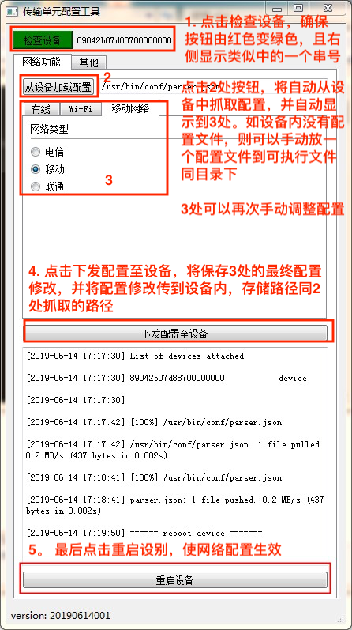

# 一个产生网络配置(json)的工具
## 开发环境
* MacOS Mojave
* VSCode Version 1.35.0 (1.35.0)
* Python 3.6.4
* PyQT5
* QT Designer 5.12.3

## 使用说明
### MacOS/Linux
> make 

或者
> python mainUI.py
### Window
> python mainUI.py

## 使用方式
1. 使用USB线将设备与电脑相连
2. 设备管理器里出现“ADB”的设备
3. 参照图片依次点击执行配置

## 使用环境搭建
### 安装python3
https://www.python.org/downloads/windows/

### 安装pip
https://pypi.org/project/pip/#files

https://blog.csdn.net/u010916338/article/details/81104554

### 安装PyQT
https://www.cnblogs.com/syh6324/p/9484208.html

### PATH环境变量配置
将python命令文件加入PATH环境变量

Windows下同时加入 python/scripts/ (for pip)

## 开发环境搭建
### PyQT基本串口程序(for MacOS)
https://nikolak.com/pyqt-qt-designer-getting-started/
### 打包至多个平台(eg: Windows)
http://www.pyinstaller.org/

安装pyinstaller
> pip install pyinstaller

打包成exe文件
> pyinstaller -F yourprogram.py

去除终端黑框方式，但此命令暂时有问题待解(点击内部按钮闪退)
> pyinstaller -F -w yourprogram.py

## 开发遇到整理
### vscode unable to import 'pyqt5'
https://stackoverflow.com/a/51010506/2422318

### AttributeError: module 'PyQt5.QtGui' has no attribute 'QMainWindow'
https://blog.csdn.net/weixin_42137589/article/details/81489363